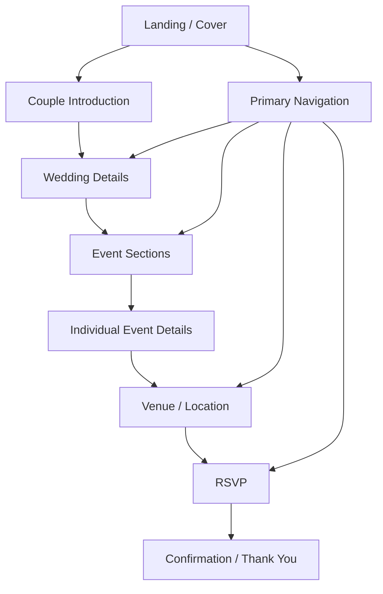
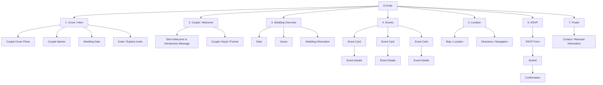
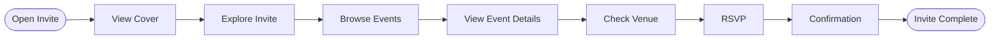

# E-Invite Structure & Element Flow

This document defines the structural hierarchy and user flow of the Gyan–Akshita e-invite.

## High-level flow

## Page/component hierarchy

## Functional elements

| Section | Core elements | Purpose |
|---|---|---|
| Cover | Couple photo, names, date, entry CTA | First visual impression |
| Introduction | Welcome message, couple visual | Establishes the invitation context |
| Wedding overview | Date, venue, key information | Gives the essential event information |
| Events | Event cards and event details | Lets guests explore each function |
| Location | Venue information, map, directions | Helps guests reach the venue |
| RSVP | Guest response form, submit action | Captures attendance |
| Confirmation | Submission confirmation | Confirms that RSVP was received |
| Footer | Relevant contact/information | Provides supporting information |

## User journey

## Design principle

The invite should follow a simple progression:

**Visual introduction → essential wedding information → event discovery → venue/location → RSVP → confirmation**

The cover should remain visually dominant, while navigation should allow a guest to reach the practical information quickly without forcing them through every section.
